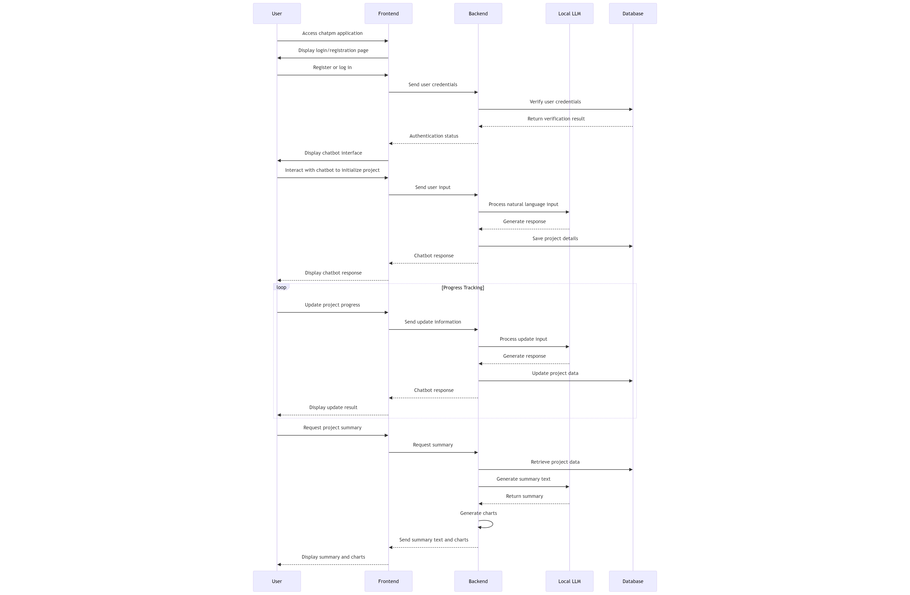

# Project Proposal for **chatpm**

---

## Overview

**chatpm** is a project management chatbot agent designed to assist project managers in initializing projects, tracking progress, and summarizing project status through interactive conversations. The application leverages a local Large Language Model (LLM) for natural language processing, ensuring data privacy and on-premises deployment. It features a web-based chat interface built with Vue.js, a backend developed using Python and FastAPI, and data persistence using PostgreSQL. The entire application is containerized using Docker for ease of deployment.

---

## Table of Contents

1. [Project Objectives](#project-objectives)
2. [Features](#features)
   - [Project Initialization](#project-initialization)
   - [Data Persistence and Storage](#data-persistence-and-storage)
   - [Tracking Project Progress](#tracking-project-progress)
   - [Summarization and Visualization](#summarization-and-visualization)
3. [Technical Implementation](#technical-implementation)
   - [Frontend](#frontend)
   - [Backend](#backend)
   - [Database](#database)
   - [LLM Integration](#llm-integration)
   - [Containerization](#containerization)
   - [Security and Compliance](#security-and-compliance)
4. [Deployment](#deployment)
5. [Future Enhancements](#future-enhancements)
6. [Next Steps](#next-steps)
7. [User Stories](#user-stories)
---

## Project Objectives

- **Assist Project Managers:** Provide a tool that helps project managers initialize projects, track progress, and generate summaries.
- **Interactive Chatbot Interface:** Use natural language processing to create an intuitive and conversational user experience.
- **On-Premises Deployment:** Ensure all data remains within the organization's infrastructure for privacy and security.
- **Scalable Architecture:** Design the system to accommodate future enhancements and integration capabilities.

---

## Features

### Project Initialization

- **Interactive Setup:**
  - The chatbot guides the project manager through initializing a new project by asking relevant questions.
- **Dynamic Questioning:**
  - Adapts questions based on previous answers.
  - Allows users to skip or revisit questions.
- **Data Captured:**
  - Project name, description, start and end dates.
  - Goals, objectives, milestones, and potential risks.

### Data Persistence and Storage

- **Database:**
  - Uses PostgreSQL for robust and relational data storage.
- **User Management:**
  - Supports multiple users with independent workspaces.
  - Role-based access control with Project Managers and Admins.
- **Security:**
  - Passwords hashed securely.
  - Data encrypted in transit and at rest as needed.

### Tracking Project Progress

- **Progress Updates:**
  - Users can update project status through natural language inputs.
- **Task Management:**
  - Add, edit, or delete tasks and milestones via chatbot commands.
- **Issue and Risk Logging:**
  - Report issues or risks, which are tracked for reporting.
- **Progress Calculation:**
  - Automatic computation of project completion percentage.

### Summarization and Visualization

- **Text Summaries:**
  - Generate reports highlighting completed and pending tasks, milestones, and upcoming deadlines.
- **Charts and Visualizations:**
  - Gantt charts for project timelines.
  - Pie charts or bar graphs showing task completion status.
- **Display Options:**
  - Rendered within the chatbot interface using markdown.
  - Option to download as PDF or image files.

---

## Technical Implementation

### Frontend

- **Framework:**
  - Built using Vue.js for a responsive and interactive user interface.
- **Chat Interface:**
  - Provides a conversational interface for user interaction.
- **Markdown Support:**
  - Displays text and images formatted using markdown.

### Backend

- **Framework:**
  - Developed using Python and FastAPI for high performance and ease of development.
- **API-First Design:**
  - All functionalities are exposed via RESTful API endpoints.
- **Session Management:**
  - Maintains user sessions and context for conversations.

### Database

- **Database Choice:**
  - PostgreSQL for reliable and scalable relational data storage.
- **ORM:**
  - Utilizes SQLAlchemy for database interactions.
- **Data Models:**
  - Defines schemas for users, projects, tasks, and other entities.

### LLM Integration

- **Local LLM:**
  - Integrates with Ollama running Llama 3.1:8b model locally.
- **Communication:**
  - Backend communicates with the LLM for processing natural language inputs.
- **Performance Considerations:**
  - Hardware recommendations to ensure smooth operation.

### Containerization

- **Docker:**
  - The entire application is containerized for consistent deployment.
- **Docker Compose:**
  - Orchestrates multiple containers (frontend, backend, database, LLM).
- **Environment Configuration:**
  - Uses environment variables for configuration management.

### Security and Compliance

- **Authentication and Authorization:**
  - Implements secure user authentication and role-based access control.
- **Data Protection:**
  - SSL/TLS for data in transit.
  - Compliance with data protection regulations.
- **Password Management:**
  - Secure hashing algorithms for password storage.

---

## Deployment

- **On-Premises Deployment:**
  - Designed to run within the organization's infrastructure.
- **Hardware Requirements:**
  - Recommended specifications provided for developer PCs.
- **Scalability:**
  - The architecture allows for scaling resources as needed.
- **Testing and Development:**
  - Supports local development environments for testing without Docker if necessary.

---

## Future Enhancements

- **Notifications:**
  - Integration with MS Teams and email for notifications.
- **Additional Integrations:**
  - Potential to integrate with other project management tools.
- **Advanced Analytics:**
  - Incorporate more sophisticated data analysis and reporting features.
- **User Collaboration:**
  - Expand to support collaborative features among multiple users.

---

## Next Steps

1. **Development Plan:**
   - Outline a roadmap with milestones and timelines.
2. **Set Up Development Environment:**
   - Follow the provided step-by-step guide for environment setup.
3. **Prototype Development:**
   - Begin with an MVP focusing on core functionalities.
4. **Testing:**
   - Implement unit and integration tests.
5. **Documentation:**
   - Create comprehensive documentation for developers and users.
6. **Feedback and Iteration:**
   - Collect user feedback to refine and improve the application.

# User Stories

*Figure: High-level user story diagram illustrating different user roles and their interactions in the current phase of the chatpm project.*

The diagram above showcases the key functionalities available to each user role in the **chatpm** application. It provides a visual representation of how Project Managers and Admins interact with the system to achieve their goals.

- **Project Managers** can:
  - Create and manage their own projects.
  - Update project details and track progress.
  - Generate summaries and visualizations for reporting.

- **Admins** can:
  - View and query all projects in the system.
  - Manage user accounts and control access.

Both roles authenticate to access the system's features, ensuring secure and role-based interactions.

---

**Note:** This proposal outlines the key aspects of the **chatpm** project, providing a roadmap for development and implementation. It is designed to be flexible to accommodate future requirements and enhancements.

---
